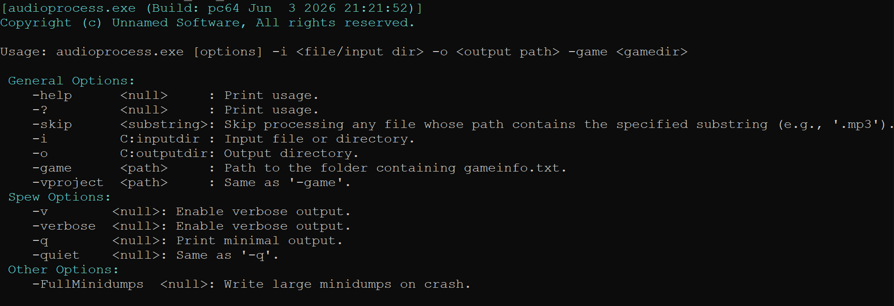

[Source Engine](https://developer.valvesoftware.com/wiki/Source) expects audio in a specific format: WAV, 44100 Hz, 16-bit PCM. Any other format needs to be converted before it can be used in the game. Doing that manually for every audio file in the project doesn't scale.

AudioProcess converts any audio file — or an entire directory of them — to the correct format in one command.


```
// Single file
audioprocess.exe -game "C:/Games/MyMod/mygame" -i mysound.mp3 -o sounds/

// Entire directory, recursively
audioprocess.exe -game "C:/Games/MyMod/mygame" -i source_audio/ -o game/sound/
```



---

### Supported formats

AudioProcess accepts 26 input formats: mp3, aac, m4a, flac, wav, ogg, opus, wma, alac, ac3, aiff, aif, amr, mp2, ape, tta, tak, wv, mlp, alaw, ulaw, gsm, qcp, mod, xm, it, s3m.

Any of those can be excluded from a batch run with a flag.

All output is WAV, 44100 Hz, signed 16-bit PCM — the format [Source Engine](https://developer.valvesoftware.com/wiki/Source) requires.

---

### Implementation

AudioProcess uses FFmpeg for all decoding and resampling. For each file the pipeline is:

**1 — Open and probe**
Opens the container and detects the audio stream, then selects the audio stream index.

**2 — Decode**
Sets up the decoder for the stream's codec. Frames are read and decoded.

**3 — Resample**
Every decoded frame is resampled to 44100 Hz, stereo (or original channel count if mono). The resampler preserves the original channel layout — a mono source stays mono, stereo stays stereo.

**4 — Write WAV**
The output WAV is written manually with a hand-built RIFF header. The header is written with placeholder sizes first, then the PCM data is written frame by frame, and the RIFF and data chunk sizes are patched back in at the end once the total is known.

---

### Batch mode

In path mode, AudioProcess scans the input directory recursively — one glob pattern per supported extension. All results are collected into a single list before conversion starts.

The directory structure is preserved in the output.

Per-operation counters track completed, failed, and skipped conversions. The summary is printed at the end.

---

### Why this matters for a pipeline

Every audio file an artist drops into the project needs to be in Source Engine format before it can be tested in game. Without a conversion step in the pipeline, that's a manual process every time a file changes.

AudioProcess fits into ContentBuilder the same way every other tool does — one command, `-game` path, input and output directories. The conversion step runs automatically as part of the build.

---

### Example in action

This conversion unit test was done with the same files that the [FFmpeg](https://www.ffmpeg.org/) team uses to test their modules.

<!-- TODO: embed demo video here (native LinkedIn video, not recoverable from export) -->
<video src="/unsuario2_website/media/source_engine/tooling/audprccs/audprccs_1.mp4" controls></video>

---

### Code

Although the public GitHub code is not updated but the core principles are still the same: [github.com/Unusuario2/AudioProcess](https://github.com/Unusuario2/AudioProcess)

---

*Part of an ongoing series on the custom Source Engine tooling I'm building for my game. More tools and systems coming.*
