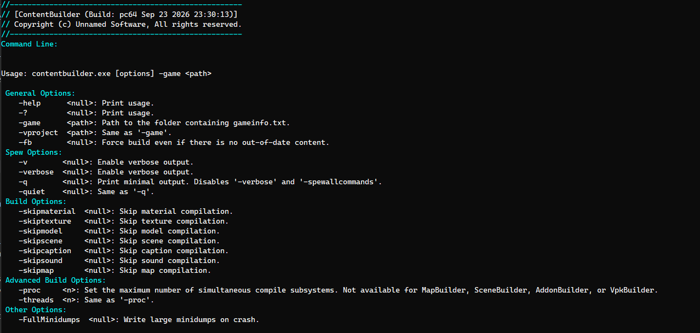

[ResourceCompiler](/unsuario2_website/posts/source_engine/tooling/rescmp/resourcecompiler) knows how to compile *one* asset, whatever type it is. That's the right tool when an artist just changed a texture. It's the wrong shape for "build the whole game" — that's not one asset, it's potentially thousands, and running them one at a time, sequentially, in a loop, would make a full build take however long the slowest possible sum of every compile happens to be.

ContentBuilder is that full-tree build. Point it at a game, and it finds everything that needs compiling and compiles it across several processes at once.

```
contentbuilder.exe -game "C:/Games/MyMod/mygame"
```



---

### Finding what actually needs building

ContentBuilder asks **assetsystem** for literally everything it knows about — `AddAllAssetTypesToTheCache()` followed by `EnumerateAllAssetsInCache()`, the same cache [ContentCheck](/unsuario2_website/posts/source_engine/tooling/cntnckc/contentcheck) validates against — then filters that list down in two passes:

1. Keep only assets whose type `IsCompilable()`. Binary-only assets with no source file don't belong in a build queue.
2. Pull out anything whose `GetSyncStatus()` is `ASSET_SYNC_MISSING_BOTH`, `ASSET_SYNC_MISSING_SOURCE`, `ASSET_SYNC_ORPHAN`, or `ASSET_SYNC_UNKNOWN`. Those can't be compiled correctly regardless.

Everything left over is what actually gets built this run.

---

### Two passes: everything else, then maps

Scenes get pulled out and compiled in one shot — a single `resourcecompiler.exe -scenes -contentbuildermode -game <dir>` call handles every scene asset in the game at once, rather than one process per scene.

Maps get pulled out too, but for a different reason: they aren't compiled through ResourceCompiler directly. Each one is handed to [MapBuilder](/unsuario2_website/posts/source_engine/tooling/mpbld/mapbuilder) instead — `mapbuilder.exe -game <dir> <file.vmf>` per map — since a map compile is the multi-stage VBSP/VVIS/VRAD sequence MapBuilder is already responsible for, not something ContentBuilder needs to know how to orchestrate itself.

Everything else — materials, textures, sounds, models, close captions — goes through ResourceCompiler one file at a time:

```
resourcecompiler.exe -contentbuildermode -game <dir> <asset file>
```

---

### Parallel compilation with a bounded task window

Every per-asset compile is one OS process (`resourcecompiler.exe` or `mapbuilder.exe`), launched through `StartExecutable`. ContentBuilder runs a bounded number of those concurrently using `std::async` and a sliding window of `std::future<void>`:

```cpp
tasks.emplace_back(std::async(std::launch::async, [=]() { /* run one compile, record it in the report */ }));

if (tasks.size() >= numthreads)
{
    tasks.front().get();        // wait for the oldest in-flight task
    tasks.erase(tasks.begin()); // and drop it
}
```

Materials, textures, sounds, models and captions all share the same task window, so a build isn't waiting on one category to finish before starting the next — it's bounded by total concurrent processes, not by asset type.

---

### The report

Every compile — completed, failed, or skipped — gets recorded into `_build\contentbuilder_report.txt`, right alongside `_build\contentbuilder.log`.

Example report `_build\contentbuilder_report.txt`:
```
"ContentBuilderReport"
{
	"CompileDate"		"Thu Sep 24 08:56:20 2026"
	"Successful"
	{
		"materials\debug\debugcamerarendertarget"
		{
			"Content"		"y:\buildworker\tssr_rel_win64\content\platform\materials\debug\debugcamerarendertarget.vmtbuilder"
			"Game"		"y:\buildworker\tssr_rel_win64\game\platform\materials\debug\debugcamerarendertarget.vmt"
			"CommandLine"		"y:\buildworker\tssr_rel_win64\game\bin\x64\resourcecompiler.exe -contentbuildermode -game Y:\buildworker\tssr_rel_win64\game\platform\ y:\buildworker\tssr_rel_win64\content\platform\materials\debug\debugcamerarendertarget.vmtbuilder"
		}
	}
    "Failed"
	{
		"materials\debug\debuglightingonly"
		{
			"Content"		"y:\buildworker\tssr_rel_win64\content\platform\materials\debug\debuglightingonly.vmtbuilder"
			"Game"		"y:\buildworker\tssr_rel_win64\game\platform\materials\debug\debuglightingonly.vmt"
			"CommandLine"		"y:\buildworker\tssr_rel_win64\game\bin\x64\resourcecompiler.exe -contentbuildermode -game Y:\buildworker\tssr_rel_win64\game\platform\ y:\buildworker\tssr_rel_win64\content\platform\materials\debug\debuglightingonly.vmtbuilder"
		}
    }
	"Skip"
	{
		"models\dev\primitives\primitive_cone_001\primitive_cone_001"
		{
			"Content"		"y:\buildworker\tssr_rel_win64\content\platform\models\dev\primitives\primitive_cone_001\primitive_cone_001.qc"
			"Game"		"y:\buildworker\tssr_rel_win64\game\platform\models\dev\primitives\primitive_cone_001\primitive_cone_001.mdl"
			"CommandLine"		"Null"
		}
	}
}
```

The log itself is buffered in memory (`CContentBuilderLoggingListener`) and flushed to disk immediately the moment anything hits `LS_ERROR`, in addition to a final flush on shutdown — so a crash mid-build doesn't lose the log that would explain why.

---

### Why this matters for a pipeline

Every other tool in this series answers "how do I compile *this*" — one material, one sound, one map. ContentBuilder answers "is the entire game's content up to date," and answers it in parallel instead of one file at a time. It's the step that actually runs before a build ships: not because any single asset is hard to compile, but because compiling all of them, correctly, and knowing afterward exactly what succeeded and what didn't, isn't something you want to do by hand.

---

### Example in action
Scene, models and maps are not compiled in this video showcase.

<video src="/unsuario2_website/media/source_engine/tooling/cntnbld/cntnbld_1.mp4" controls></video>


---

*Part of an ongoing series on the custom Source Engine tooling I'm building for my game. More tools and systems coming.*
