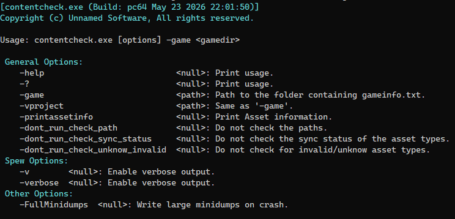
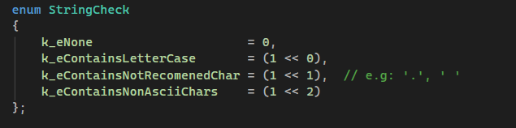
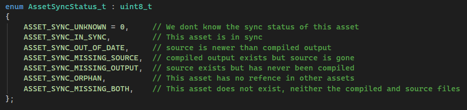
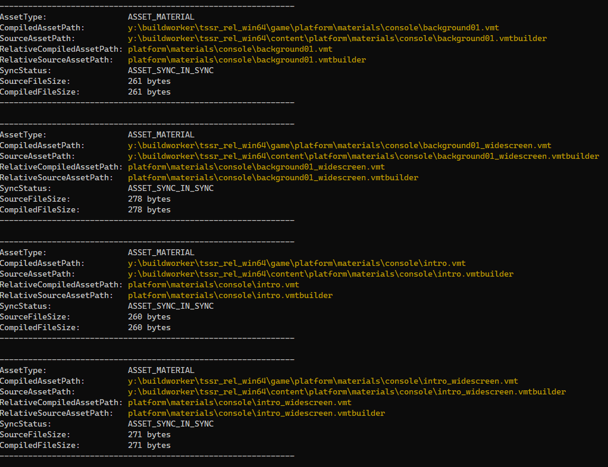
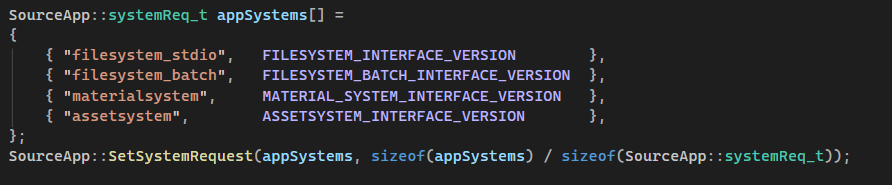

Before shipping a build, you need to know the state of your assets. Are all compiled files in sync with their source? Are there paths with uppercase letters that will break on Linux? Are there assets with non-ASCII characters, spaces, or paths exceeding the 260-character Windows limit? Are there unknown or invalid assets in the game directory?

ContentCheck answers all of those questions in one run and writes a full report to disk.

It is invoked like any other Source tool.

```
contentcheck.exe -game "C:/Games/MyMod/mygame"
```



---

## What it checks

ContentCheck runs three validation passes in sequence, each writing results to `_build/contentcheck_report.txt`:

**Step 1: Path integrity.**

Validates every asset path against three rules, using a bitmask flag system internally:

- No uppercase letters: Source Engine is case-sensitive on Linux; uppercase paths cause silent failures.
- No spaces or extra dots: for convention and to avoid breaking some SDK tools.
- No non-ASCII characters: causes undefined behavior in path operations.
- No paths exceeding 260 characters: Source Engine `MAX_PATH` limit.




**Step 2: Sync status.**

Iterates every asset type in the cache and checks whether the compiled output is in sync with its source file. Six sync states are reported.



**Step 3: Unknown and invalid assets.**

Enumerates assets flagged as `ASSET_UNKNOWN` or `ASSET_INVALID` in the cache — files the asset system couldn't classify or that failed validation during cache population.

**Step 4: Printing all the asset information.**

Sometimes as a developer you want to see all the information related to an asset. ContentCheck can do this with the **-printassetinfo** command line flag.



---

## Implementation

ContentCheck loads four modules at startup.




The assetsystem module is a custom asset management layer — `IAssetSystemMgr` — that populates a cache of all known assets across the content and mod search paths via `AddAllAssetTypesToTheCache()`. All three check passes operate on that cache through `EnumerateAssetsInCache()` and `EnumerateAllAssetsInCache()`.

The path integrity check uses a bitmask `StringCheck` enum to accumulate multiple violations per path in a single pass, rather than short-circuiting on the first failure. This means a path with both uppercase letters and spaces gets both warnings reported — useful when fixing a large batch of assets.

The sync check iterates every `AssetType_t` in the enum range and for each type queries every asset's `GetSyncStatus()`. Compilable assets (those with a source file) report both source and compiled paths. Non-compilable assets (binary-only) report only the compiled path.

Everything accumulates into a `CUtlBuffer` in `TEXT_BUFFER` mode and gets written to `_build/contentcheck_report.txt` at the end. The `_build` directory is the same one ContentBuilder uses — the report lives alongside the rest of the build output.

---

## Why this matters for a pipeline

Asset problems that go undetected before a build become problems during or after shipping. A texture with an uppercase path works on Windows but breaks on Linux. A compiled asset that's out of date ships stale data. An orphaned output bloats the package with files that have no source.

ContentCheck is the validation step that runs before the build goes out. It doesn't fix anything — it tells you exactly what needs attention and where.

---

### Example in action

- contentcheck only checking if the paths are correct.  

<video src="/unsuario2_website/media/source_engine/tooling/cntnckc/cntnckc_1.mp4" controls></video>

- contentcheck only checking the sync status of the assets.

<video src="/unsuario2_website/media/source_engine/tooling/cntnckc/cntnckc_2.mp4" controls></video>

- contentcheck in full action.

<video src="/unsuario2_website/media/source_engine/tooling/cntnckc/cntnckc_3.mp4" controls></video>

<!-- Caption 1: "contentcheck only checking if the paths are correct." -->

---

*Part of an ongoing series on the custom Source Engine tooling I'm building for my game. More tools and systems coming.*
