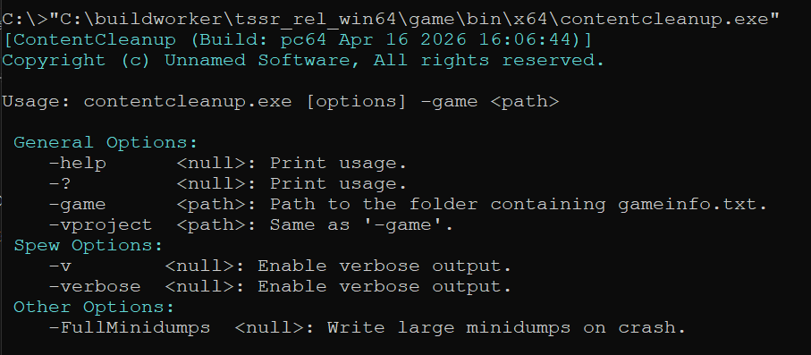

**ContentCleanup** is a command-line tool for Source Engine that deletes temporary files and directories from the game directory. What gets deleted is defined by a **KeyValues** settings file that lives inside the game directory itself at **scripts/tools/contentcleanup_settings.txt**.

It is invoked like any other Source tool.

```
contentcleanup.exe -game "C:/Games/MyMod/mygame"
```

It automates the cleanup step so your game directory doesn't bloat over time and your Steam builds don't ship with compiler leftovers, with no extra setup required.




---

### Implementation

The tool uses [IFileSystemBatch from filesystem_batch.dll](/blog/file-system-batch-operations-source-engine/) for batch/glob operations. For the actual deletion work, a **KeyValues** file is loaded for the config. Game path setup is the same as the rest of the toolchain (goes through **CmdLib_InitFileSystem**).

The main loop iterates every key in the settings file and dispatches by type.

Missing paths produce a warning and continue — they don't abort the run. Unknown key names also warn, so typos in the settings file don't silently no-op.

One thing worth noting: the game path is normalized to forward slashes early in init with **V_FixSlashes(gamedir, '/')**. Glob patterns break on Windows backslash paths, so this needs to happen before any path construction.

---

### Settings file

The settings file supports three key types:

- **Dir:** to remove a directory recursively.
- **Glob:** to remove files matching a pattern.
- **File:** to remove a single file.

All paths are relative to the game directory.

**contentcleanup_settings.txt**

```
"ContentCleanup" 
{
	// Note: This is always relative to the gamedir. 
	// For paths ALWAYS use the separator '/' for folders and never '\'	
	// You will run into some issues if done.
	// Three supported KeyValues:
	//	Dir : Delete the directory
	//	Glob: Given a Glob pattern delete files.
	//      File: Delete the file.

	// Builder dir
	"Dir"	"_build"
	"Dir"	"_mapbuilder"
	"Dir"	"_unittest"

	// Temp/user dir
	"Dir"	"logs"
	"Dir"	"reslists"
	"Dir"	"save"
	"Dir"	"screenshots"
	"Dir"	"cubemap_screenshots"
	"Dir"	"screenshots"
	"Dir"	"testscripts"
	"Dir"	"config"
	"Dir"	"downloadlists"
	"Dir"	"downloads"
	"Dir"	"download"
	"Dir"	"sound_workshop"
	"Dir"	"workshop"
	"Dir"	"user_custom"
	"Dir"	"replay"

	// We pack the files inside the vpk map.
	"Dir"		"maps/graphs"
	
	// Temp files
	"Glob"	"/**/*.cache"
	"Glob"	"/**/*.tmp"
	"Glob"	"/**/*.dt"
	"Glob"	"/**/*.log"
	"Glob"	"/**/*.csv"
	"Glob"	"/**/*.lst"
	"Glob"	"/**/*.mdmp"

	// We pack the file inside the vpk map.
	"Glob"	"/**/*.nav"

	// User files generated by running the mod.
	"File"	"gamestate.txt"
	"File"	"stats.txt"
	"File"	"cfg/server_blacklist.txt"
	"File"	"cfg/config.cfg"
	"File"	"steam.inf"
	"File"	"textwindow_temp.html" 
}
```

---

### Example in action

<video src="/unsuario2_website/media/source_engine/tooling/cntnclp/cntnclp_1.mp4" controls></video>


---

## Design references

- Glob Pattern: [https://www.malikbrowne.com/blog/a-beginners-guide-glob-patterns/](https://www.malikbrowne.com/blog/a-beginners-guide-glob-patterns/)

---

*Part of an ongoing series on the custom Source Engine tooling I'm building for my game. More tools and systems coming.*
