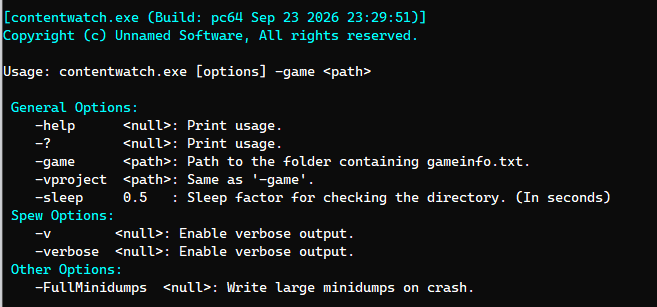

[ContentBuilder](/unsuario2_website/posts/source_engine/tooling/cntnbld/contentbuilder) answers "is the whole game up to date" and [ResourceCompiler](/unsuario2_website/posts/source_engine/tooling/rescmp/resourcecompiler) answers "compile this one file I'm naming" — but neither answers "keep compiling whatever I just changed, right now, while I'm working." That gap is a real cost during iteration: an artist tweaking a texture shouldn't have to alt-tab to a terminal and retype a compile command every time they hit save.

ContentWatch is a small utility that sits on a content directory and does exactly that.

```
contentwatch.exe -game "C:/Games/MyMod/mygame"
```



---

### A narrower cache than ContentBuilder's

ContentBuilder seeds its asset cache with everything assetsystem knows about, across every asset type it can find. ContentWatch is scoped tighter — it only caches what's actually under the target game's content directory, via `AddFilesFromDirToTheCache()`, then hands that same directory to a recursive file watcher (`filewatch::FileWatch<std::string>`) instead of polling it on a loop.

---

### One callback, five event types

The watcher's callback receives a `filewatch::Event` for everything that happens under the content tree — `added`, `removed`, `modified`, `renamed_old`, `renamed_new` — and routes each one:

| Event | What happens |
|---|---|
| `added` / `modified` / `renamed_old` / `renamed_new` | `CompileWatchAsset()` — recompile it |
| `removed` | drop it from the asset cache (`ClearFileInCache`), no compile |

Two kinds of paths get filtered out before any of that: directories (the watcher fires on folders too, but there's nothing to compile), and anything containing `_vmtbuilder` or `_vftbuilder` — the temp folders [MaterialBuilder](/unsuario2_website/posts/source_engine/tooling/matbld/materialbuilder) creates and deletes mid-compile. Without that filter, MaterialBuilder writing its own intermediate files while compiling a texture would itself trigger a change event, which would start another compile, which would write more temp files — ContentWatch reacting to its own compiler's side effects. The check is just a substring match on the folder name, not something the watcher's OS-level API filters for it.

---

### Guard checks before spending a compile

`CompileWatchAsset()` looks at `GetSyncStatus()` before doing anything: already `ASSET_SYNC_IN_SYNC` just logs and returns, `ASSET_SYNC_MISSING_BOTH` / `ASSET_SYNC_MISSING_SOURCE` logs that it can't be compiled and returns, `ASSET_SYNC_UNKNOWN` does the same. Only an asset that's actually out of date and has a known, compilable state reaches the point of building a command line:

```
resourcecompiler.exe -game "<gamedir>" "<source asset path>"
```

The watcher's callback blocks on that one compile before it's ready to process the next file system event — there's no task queue or thread pool here the way ContentBuilder has one. For a single artist saving a single file, that's the right tradeoff: reacting to one change at a time, in order, is simpler and exactly as fast as it needs to be. A short sleep (`-sleep`, tenths of a second, applied after every handled event) debounces the callback so a single save that fires multiple file system events in quick succession doesn't queue up redundant compiles.

---

### Why this matters for a pipeline

ContentBuilder and ContentWatch cover opposite ends of the same problem. ContentBuilder is the deliberate, from-scratch pass across everything, run before a build ships. ContentWatch is the background process an artist and tooling (like assetbrowser) leaves running while they work, so the round trip from "changed a source file" to "see the compiled result" doesn't require typing its command line by hand.

---

### Example in action

Showcase of the automatic compiles:

<video src="/unsuario2_website/media/source_engine/tooling/cntnwch/cntnwch_1.mp4" controls></video>

---

*Part of an ongoing series on the custom Source Engine tooling I'm building for my game. More tools and systems coming.*
