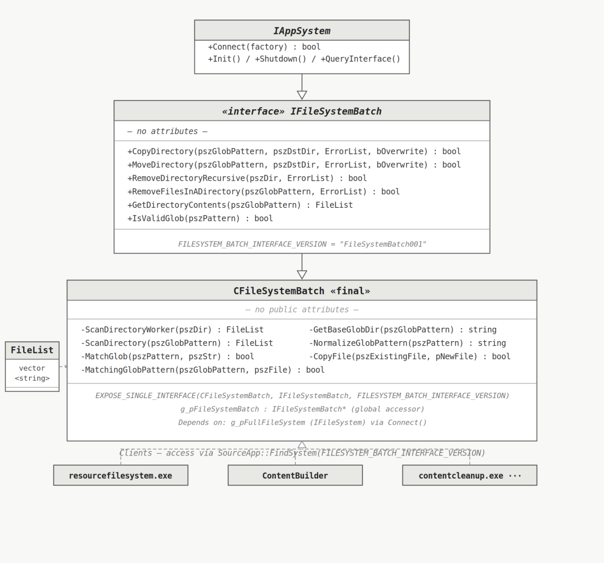
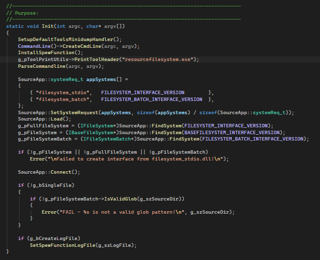
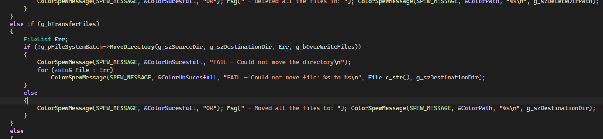
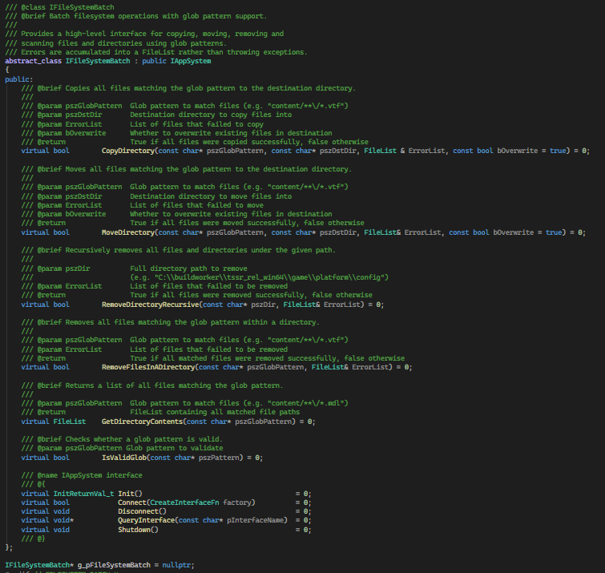

## filesystem_batch.dll — Adding glob pattern support to Source Engine

Source Engine has basic wildcard support in its filesystem. Basic is the key word. It doesn't hold up when you're building an asset pipeline that needs to operate on large sets of files with real glob patterns and batch operations.

So I extended it with **filesystem_batch.dll**.

---

### What it does

It adds full glob pattern matching to the Source Engine filesystem through a facade module: you pass a pattern, it scans the directory, matches against the glob, discards what doesn't match, and returns the result. Batch operations on file sets with a clean interface on top of the existing filesystem.

---

### Design decisions

**DLL module** to keep it modular and reusable across tools and games. Any tool in the pipeline can consume it without pulling in unrelated code.

**Facade pattern.** The facade isolates the rest of the pipeline from filesystem internals. Clients don't need to know how the scanning or matching works — they just call the interface.

**Interface + Singleton.** Abstracts the implementation from the client. One instance, consistent state, clean access point across the pipeline.

**Portability.** Designed to be portable to other platforms such as POSIX or macOS if needed.

**Performance.** Fast enough that it doesn't become a bottleneck in the build process.

---

### Example in action

**resourcefilesystem.exe** — a tool that exposes the filesystem_batch API directly to the user, allowing manual glob queries against the Source Engine filesystem from the command line.

<video src="/unsuario2_website/media/source_engine/tooling/flb/flb_2.mp4" controls></video>

**contentcleanup.exe** — sanitizes the game directory by removing temporary and user-generated files using glob-based pattern matching.

<video src="/unsuario2_website/media/source_engine/tooling/flb/flb_1.mp4" controls></video>

There are many more examples where **filesystem_batch** is used across the tooling (ContentBuilder, ContentWatch, ContentCheck, ResourceCompiler).

---

### Code snippet

---

### Class diagram (UML)

---

### Design references

- Facade pattern: [https://refactoring.guru/design-patterns/facade](https://refactoring.guru/design-patterns/facade)
- Singleton pattern: [https://refactoring.guru/design-patterns/singleton](https://refactoring.guru/design-patterns/singleton)

---

*Part of an ongoing series on the custom Source Engine tooling I'm building for my game. More tools and systems coming.*
