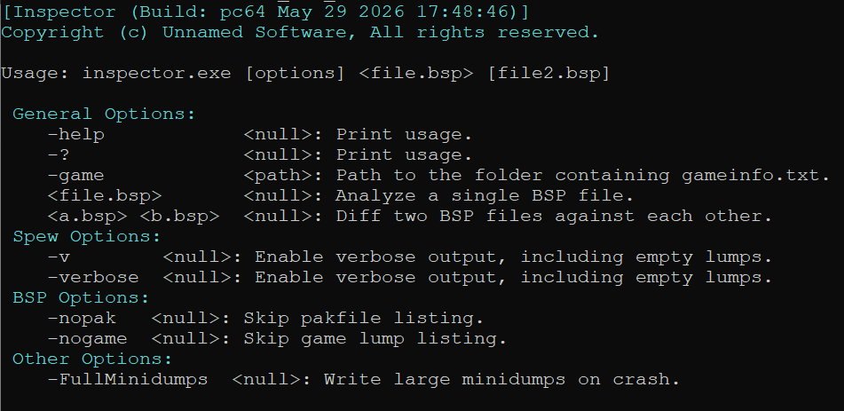
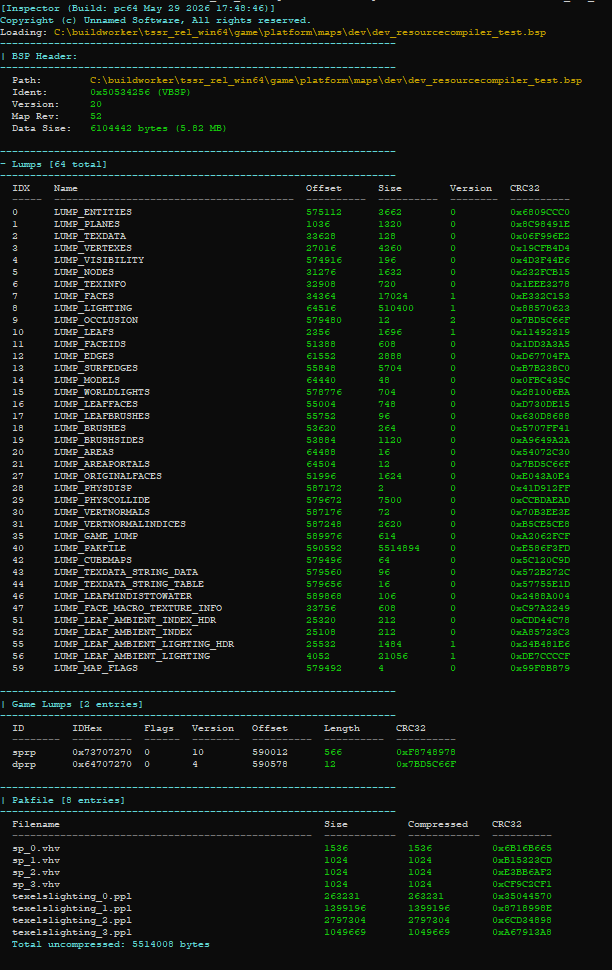
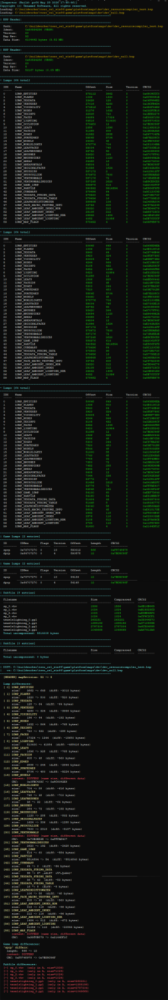

When you're modifying a compiler like VBSP or VRAD, you need to know exactly what changed in the output. Which lumps grew or shrank. Whether the lighting data is actually different or just reordered. What the pakfile contains. Whether two builds of the same map are byte-for-byte identical in the parts you didn't touch.

Inspector reads a compiled BSP file and shows you its internal state. Pass two files and it diffs them.

It is invoked like any other Source tool.

```
inspector.exe <bpsfile> <bpsfile2> -game "C:/Games/MyMod/mygame"
```




---

### What it shows

A BSP file is a binary container made of 64 lumps — each lump stores a different type of data. Inspector loads the entire file into memory and parses every layer:

**BSP header.** Version, map revision, total data size in bytes and MB.

**All 64 lumps.** For each lump: index, name, file offset, size, version, and a CRC32 checksum of the lump data. Empty lumps are hidden by default.

**Game lumps (lump 35).** The game lump is a container inside the BSP that holds sub-lumps with game-specific data (static props, detail props, etc.). Inspector decodes each entry's 4-byte FourCC ID into a human-readable string, and reports offset, length, version, flags, and CRC32.

**Pakfile (lump 40).** The pakfile is an embedded ZIP archive inside the BSP. Inspector scans it manually by walking the raw bytes looking for the ZIP local file header signature, extracting filename, uncompressed size, compressed size, and CRC32 for every entry. Total uncompressed size is reported at the end.

**Console output:**




---

### Diff mode

Pass two BSP files and Inspector runs a full structural diff:

**Header diff** — version and map revision changes between builds.

**Lump diff** — for every lump that changed: size delta in bytes, version change, and whether the content differs (detected by CRC32 mismatch). A lump with the same size but a different CRC means the data was modified in place — the kind of change that's easy to miss otherwise.

**Game lump diff** — entries present only in A, only in B, or present in both but with different length, version, or content.

**Pakfile diff** — files added, removed, or modified between builds, with size delta and CRC comparison for each.

**Console output:**




---

### Implementation

Inspector loads the entire BSP into memory in one read, then operates on raw pointers into that buffer — no seek operations, no partial reads. The header is copied into a struct directly. All 64 lump entries are parsed in a single loop, computing a CRC32 per lump with a standard polynomial.

The pakfile parser doesn't use any ZIP library. It walks the raw bytes in the pakfile lump scanning for the local file header signature, reads the fixed-offset fields, extracts the filename, and advances to the next position. No decompression — just structural inspection.

Game lump IDs are stored as 4-byte integers. Inspector reverses the byte order and prints them as ASCII strings — that's how Source's FourCC identifiers work.

All output is color-coded: green for matching/present data, yellow for differences, red for errors or missing entries.

---

### Why this matters for compiler development

Modifying VRAD, VBSP, or any other compiler that writes BSP data means verifying that only the lumps you intended to change actually changed. Without a tool like this, you're comparing binary files blindly or relying on in-game behavior to catch regressions.

Inspector makes the internal state of a compiled map observable. If `LUMP_LIGHTING` grew after a change to VRAD, you see it immediately. If the pakfile is missing an entry it shouldn't be, it shows up in the diff. If two builds of the same map produce identical lumps except the one you modified, you can confirm the change is isolated.

That's the use case it was built for.

---

*Part of an ongoing series on the custom Source Engine tooling I'm building for my game. More tools and systems coming.*
