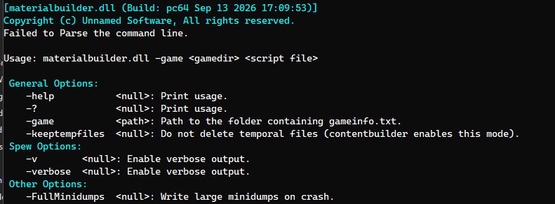

Writing a `.vmt` by hand means knowing exactly which shader you're targeting, which parameters it actually exposes, and getting every texture referenced by it compiled and pointed at the right relative path. Get any of that wrong and the error only shows up later, in-engine, as a missing texture or a silently ignored parameter.

**MaterialBuilder** takes a KeyValues script instead and produces a validated `.vmt`, catching mistakes — an unknown shader, a parameter that shader doesn't support — at compile time instead of at runtime.

```
resourcecompiler.exe "Y:\buildworker\tssr_rel_win64\content\platform\materials\models\dev\dev_uv_check.vmtbuilder"
```



---

### Two builders, one tool

**MaterialBuilder** picks its behavior from the input script's extension:

- **`.vmtbuilder`** → `CMaterialBaker` — builds a full material.
- **`.vtfbuilder`** → `CTextureBaker` — builds a single texture, standalone.

Both implement the same `IBaker` interface (`Init` → `ParseScript` → `Create` → `Compile` → `Destroy`), so the entry point in `materialbuilder.cpp` doesn't need to know which one it's driving — it just new's the right one based on the file extension and runs the same four-step sequence.

---

### Validating against the live shader list

A `.vmtbuilder` script names a shader and a set of `$`-prefixed parameters:

```
"MaterialBaker"
{
    "Shader" "UnlitGeneric"

    "$BaseTexture"
    {
        "R"     { "R"   "background_color.png" }
        "G"     { "G"   "background_color.png" }
        "B"     { "B"   "background_color.png" }
        "A"     { "A"   "background_color.png" }

        "VtexConfig"
        {
            "Preset"    "Color"
        }
    }

    "%KeyWords" "dev, matsys, internal"
}
```

Before writing a single line of `.vmt`, `CMaterialBaker::ParseScript` checks the `"Shader"` value against `g_pMaterialSystem`'s live shader list (`ShaderCount()` / `GetShaders()`) — not a hardcoded list, but whatever `materialsystem.dll` actually reports at runtime. If the shader doesn't exist, it fails immediately with the shader's name in the error.

Every `$parameter` under it goes through the same check against that specific shader's declared parameters (`GetParamName()`), so a typo'd or misplaced parameter is caught the same way. Because a chunk of parameters — `$translucent`, `$nocull`, `$vertexcolor`, `$alpha`, and about forty others — are handled by the material system itself rather than declared per-shader, those are matched against a static exclusion table instead of the shader's own param list, so they don't get rejected as unknown.

Once a parameter passes validation, `CMaterialBaker` reads its `ShaderParamType_t` from the shader and writes it into the output `.vmt` KeyValues tree as the matching type — texture, int, color, vec2/3/4, float, bool, string, or material. Two now-obsolete types (`ENVMAP`, `FOURCC`) just get a warning instead. Anything prefixed with `%` instead of `$` — like `%KeyWords` above — isn't a shader parameter at all, so it's copied through untouched; those exist for other tools like **Hammer** and **VBSP/VRAD** to read.

Example of a material with a unknow shader:
<video src="/unsuario2_website/media/source_engine/tooling/matbld/matbld_1.mp4" controls></video>

Example of a material with a unknow shader parameter:
<video src="/unsuario2_website/media/source_engine/tooling/matbld/matbld_2.mp4" controls></video>


---

### Texture parameters: reference or generate inline

A texture-typed parameter like `$BaseTexture` has two ways to resolve:

1. **Point at an existing `.vtfbuilder`.** **MaterialBuilder** compiles it as a child texture and rewrites the parameter to point at the resulting `.vtf`.
2. **Define it inline**, as in the example above — a `TextureBaker` sub-block describing which source image channels go into which destination channels. **MaterialBuilder** writes that block out to a temporary `.vtfbuilder` file and compiles it the same way, through `CTextureBaker::CompileChildren`. 
Each material that defines the texture/s as inline owns the texture, this means that is not used in any
other material, this will become later very useful for the **assetsystem** system to detect orphan textures.

Either way it's the same texture compiler underneath — a material never has its own bespoke texture-building code path, it just drives `CTextureBaker` on the material's behalf.

An `AnimatedTextureBaker` sub-block is also recognized in the script format, for frame-sequence textures — but the implementation is still a stub (`CAnimatedTextureBaker` only implements `Identifier()` right now). Referencing one in a script currently just errors out; it's next on the list.

---

### The channel compositor

`CTextureBaker` is the piece that turns a `Channels` block into an actual image:

```
"TextureBaker"
{
    "Channels"
    {
        // <destination vtf channel> { <src image channel>  <path to the src file> }
        "R"     { "R"   "mask_specular.png" }
        "G"     { "G"   "mask_specular.png" }
        "B"     { "B"   "mask_specular.png" }
    }

    "VtexConfing"
    {
        "Preset"    "Color"
    }
}
```

Each destination **RGBA** channel can pull from a *different* source image's channel — the classic Source Engine trick of packing unrelated grayscale masks (specular, AO, roughness) into one RGBA texture instead of shipping four separate files. `CGeneratedImage` loads every referenced source image with `stb_image`, checks that all of them share the same resolution, allocates a zero-filled destination buffer sized for however many channels ended up being used, and copies each source channel into its destination slot one pixel at a time.

The composited result is written out as an intermediate `.tga` via `stb_image_write`, and `vtex.dll` is called in-process (`g_pVtex->VTex(...)`) to compile that `.tga` into the final `.vtf`. Vtex's own compile flags come from a `VtexConfig` block — either a named preset resolved from `materialbuilder_settings.txt` (`VtexConfigPresets`), or ad-hoc `Param` overrides — written to a companion `.txt` file that `vtex.exe`'s config format expects.

When a texture is compiled as a child of a material rather than standalone, one more thing happens after vtex finishes: **MaterialBuilder** reopens the freshly compiled `.vtf` and stamps a small resource chunk into it (`VTF_RSRC_CHILDREN_TEXTURE_FROM_MATERIAL`) recording the parent material's name. That's what lets a generated child texture be told apart from one with its own independent `.vtfbuilder` script later — useful for tooling like ContentCheck that walks the asset cache and needs to know whether a `.vtf` is meant to be edited directly or regenerated from its owning material.

---

### Temp files and cleanup

Both bakers stage their work in a temp directory next to the source script (`_vmtbuilder\` or `_vtfbuilder\`) and delete it once the compile succeeds. `-keeptempfiles` skips the cleanup — ContentBuilder enables this mode when it drives **MaterialBuilder** as part of a larger batch, so intermediate `.tga`s and vtex config files can be inspected if something in the chain goes wrong.

---

### Example in action

<video src="/unsuario2_website/media/source_engine/tooling/matbld/matbld_3.mp4" controls></video>

--- 

### Why this matters for a pipeline

A shader's valid parameter set changes as `materialsystem.dll` evolves, and channel-packing textures by hand in an image editor doesn't scale past a handful of materials. **MaterialBuilder** ties both to the config file: the script describes intent — which shader, which parameters, which channels from which source images — and the tool resolves that against whatever the engine currently supports, failing loudly at compile time instead of leaving a broken material to be discovered later.

**MaterialBuilder** will be later used by **Material Editor** the UI tool for creating and rendering the materials for artists.

---

*Part of an ongoing series on the custom Source Engine tooling I'm building for my game. More tools and systems coming.*
