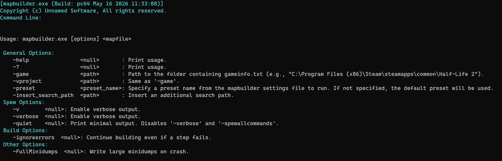
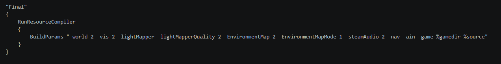
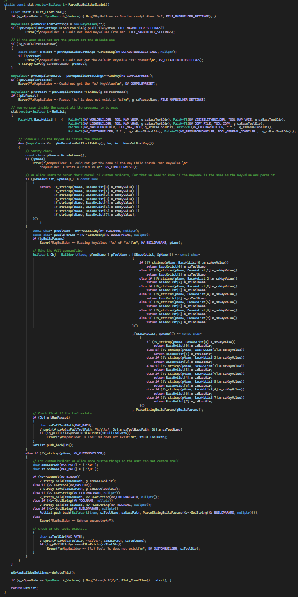
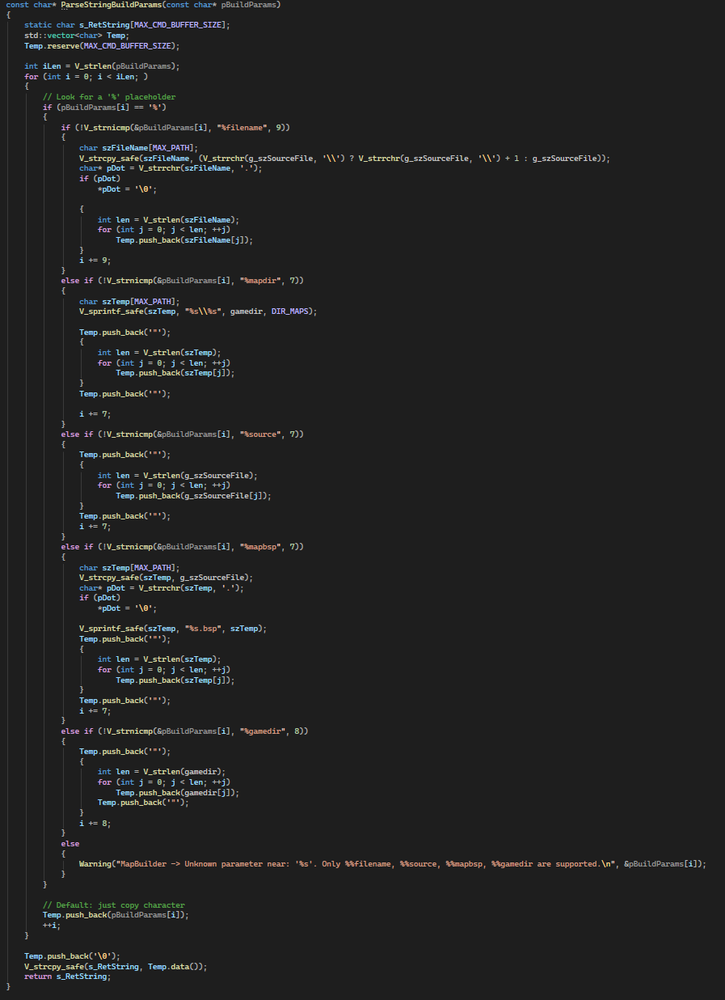
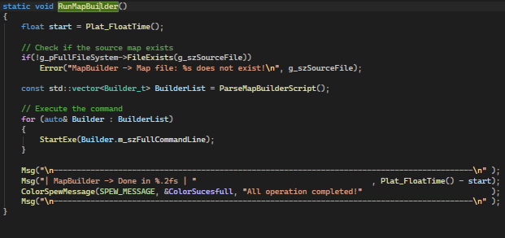

Compiling a map in Source Engine means running VBSP, VVIS, and VRAD in sequence — each with its own flags, its own paths, and its own configuration. Artists should not spend time making the configuration in Hammer Editor. Do that manually every time and someone will eventually break it.

MapBuilder abstracts the entire process into a single command and a config file.

```
mapbuilder.exe -preset Final -game "C:/Games/MyMod/mygame"  "mapsrc/mymap.vmf"
```

One command. Every step runs in order. Same result every time.



The code can be [found here](https://github.com/Unusuario2/MapBuilder). Although it is a bit outdated, the core system remains the same.

---

### The problem it solves

Map compilation in Source is not just VBSP → VVIS → VRAD. A full build also needs to copy the .bsp to the right directory, build cubemaps by launching the game executable, run vbspinfo, and optionally run custom post-processing steps. Each of those is a separate process with its own binary, its own arguments, and its own command-line options.

Without a standardized tool, every person on the team runs that sequence differently. Artists forget steps. Flags drift between machines. Builds become inconsistent.

MapBuilder defines the process once in a [KeyValues](https://developer.valvesoftware.com/wiki/Keyvalue) config file. Artists, programmers, and automated builds all use the same tool, the same preset, the same flags.

---

### How it works

The config file (`scripts/tools/mapbuilder_settings.txt`) lives inside the game directory. It defines compile presets — named sequences of build steps, each with its own parameters.

Supported build steps and their default tool:

| Key | Default tool |
|---|---|
| RunWorldBuilder | vbsp.exe |
| RunVisibilityBuilder | vvis.exe |
| RunLightBuilder | vrad.exe |
| RunMapInfo | vbspinfo.exe |
| RunTransferFile | resourcefilesystem.exe |
| RunCubemapBuilder | game executable (e.g. tf.exe) |
| RunCustomBuilder | any executable defined by the user |
| RunResourceCompiler | resourcecompiler.exe |

Every step supports a `ToolName` key to override the default executable — useful for swapping in a custom compiler or an external tool without changing any code.



---

## Features

### Path resolution

Each step has a `BuildParams` field with placeholder support. MapBuilder resolves these at runtime before building the command line:

| Placeholder | Resolves to |
|---|---|
| `%source` | Full path to the .vmf source file |
| `%filename` | Map name without extension |
| `%gamedir` | Path to the game directory |
| `%mapbsp` | Full path to the compiled .bsp |
| `%mapdir` | `gamedir/maps/<relative source map dir>` |

Example expansion:
```
RunLightBuilder
{
    BuildParams "-final -game %gamedir %source"
}
```
Expands to:
```
vrad.exe -final -game "C:\Games\MyMod\mygame" "C:\maps\mymap.vmf"
```

No hardcoded paths anywhere in the config.

---

### Tool path resolution

Each step also supports three path modes:

- `BinDir "1"` — searches for the tool in the same directory as mapbuilder.exe
- `BaseDir "1"` — searches in the base game installation path
- `ExternalPath "<path>"` — explicit path to any directory

This makes it possible to call tools that live outside the SDK bin directory — including the game executable itself for cubemap building.

---

### Preset system

The default preset is declared in the config under `DefaultMapBuilderSettings`. Any tool or artist can override it at runtime with `-preset`.

```
mapbuilder.exe -preset Fast -game "C:/Games/MyMod/mygame"  "mapsrc/mymap.vmf"
```

A full Final preset example:
```
"Final"
{
    RunWorldBuilder
    {
        BuildParams "-game %gamedir %source"
    }

    RunVisibilityBuilder
    {
        BuildParams "-game %gamedir %source"
    }

    RunLightBuilder
    {
        BuildParams "-final -extrasky 64 -bounce 250 -game %gamedir %source"
    }

    RunMapInfo
    {
        BuildParams "-worldtexturestats -treeinfo %mapbsp"
    }

    RunTransferFile
    {
        BuildParams "-f %mapbsp %mapdir"
    }

    RunCubemapBuilder
    {
        ToolName    "tf.exe"
        BuildParams "-dev -novid -sw -console -buildcubemaps map %filename"
    }
}
```

Execution order follows declaration order. Steps run top to bottom. Running VVIS before VBSP will fail — the config makes the order explicit and enforced.

---

### Implementation

The execution flow is straightforward and intentionally linear:

```
-> ParseMapBuilderScript()   — KV parse → Builder_t list
-> ParseStringBuildParams()  — placeholder substitution
-> CreateProcess() per step  — sequential execution
```

**Step 1 — Parsing the script.**
`ParseMapBuilderScript()` loads `mapbuilder_settings.txt` via the Source filesystem, resolves the active preset (default or `-preset` override), then iterates every sub-key inside that preset in declaration order. For each key it finds a match in a `PairKvTl` table that maps key names to their default tool and base path.



The result is a `std::vector<Builder_t>` — each entry holds the tool name, base path, and the fully assembled command line string, ready to execute.

**Step 2 — Placeholder substitution.**
Before each command line is built, `ParseStringBuildParams()` walks the `BuildParams` string character by character looking for `%` tokens and replaces them inline into a static buffer. Paths with spaces are automatically wrapped in quotes during expansion — `%gamedir`, `%source`, `%mapdir`, and `%mapbsp` all get quoted, `%filename` does not since it's just a name without spaces.




**Step 3 — Sequential execution.**
`RunMapBuilder()` iterates the `Builder_t` list and calls `CreateProcess()` for each entry, waiting for it to finish before starting the next. If a step fails and `-ignoreerrors` is not set, execution stops immediately. The exit code of each process determines whether the build continues.

The order of execution is exactly the order the keys appear in the config. No implicit sorting, no dependency graph — the config author is responsible for getting the order right, and the tool enforces it strictly.




---

### Why this matters for a pipeline

MapBuilder abstracts the process of compiling maps, which is particularly useful for an automated build system (ContentBuilder). It is also the tool artists run directly from the command line or from Hammer's compile configuration. Same binary, same config, same process — whether it's a human or an automated system running it.

Any modder can also drop in a custom compiler via `ToolName` and integrate it into the chain without touching the source code. The config is the interface.

---

## Example in action

- Example of MapBuilder being called by the automated build system (ContentBuilder)

<video src="/unsuario2_website/media/source_engine/tooling/mpbld/mpbld_1.mp4" controls></video>


- Example of MapBuilder being called inside Hammer editor (used by artists)

<video src="/unsuario2_website/media/source_engine/tooling/mpbld/mpbld_2.mp4" controls></video>


---

*Part of an ongoing series on the custom Source Engine tooling I'm building for my game. More tools and systems coming.*
