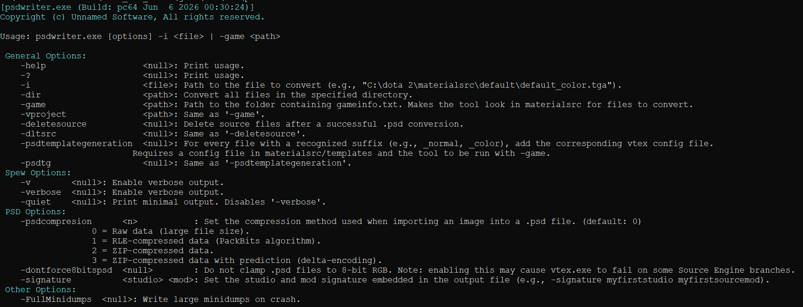
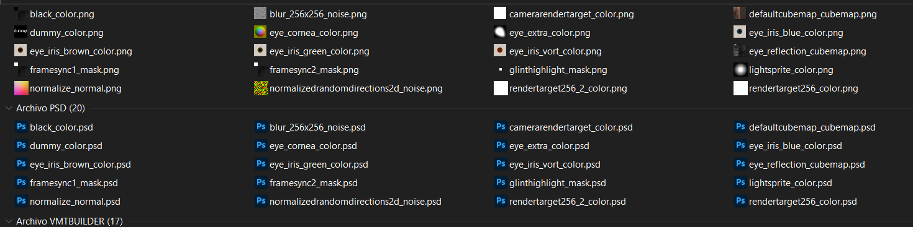

Artists working on UI, icons, and textures for Source Engine projects often work in formats like PNG, TGA, or HDR. Before those assets can be compiled with vtex, they need to be in a format Photoshop and the Source SDK toolchain can both work with. And for every texture, a .txt config file needs to be written telling vtex how to compile it.

PsdWriter automates both steps — converting images to .psd and generating the vtex config alongside.

```
// Single file
psdwriter.exe -i mytexture_color.png

// Entire materialsrc directory
psdwriter.exe -game "C:/Games/MyMod/mygame"

// Custom directory
psdwriter.exe -dir "C:/art/textures/" 
```




---

### What it does

PsdWriter converts any supported image format to a Photoshop-compatible .psd file using stb_image for decoding and psd_sdk for writing.

Supported input formats: .jpg, .jpeg, .png, .tga, .bmp, .gif, .hdr, .pic, .ppm, .pgm.

Each channel (R, G, B, and optionally A) is separated and written individually into the PSD layer — which is how psd_sdk requires the data. The merged image is also written so Photoshop displays it correctly on open.

---

### Bit-depth preservation

By default PsdWriter forces all output to 8-bit, since some Source Engine branches fail with vtex on higher bit-depth PSDs. With `-dontforce8bitspsd`, the native bit-depth of each format is preserved:

| Format | Bit-depth |
|---|---|
| .jpg, .jpeg, .tga, .bmp, .gif | 8-bit (uint8_t) |
| .png, .ppm, .pgm | 16-bit (uint16_t) |
| .hdr, .pic | 32-bit float (float32_t) |

The bit-depth dispatch is handled at compile time via `if constexpr` on a templated `WriteNBitsPsd<T>()` — one function, three specializations, no runtime branching per format.

---

### Compression modes

PSD files support four compression methods, selectable via `-psdcompression`:

| Value | Mode |
|---|---|
| 0 | RAW — no compression, fastest write |
| 1 | RLE (PackBits) — good for 8-bit data |
| 2 | ZIP |
| 3 | ZIP with prediction (delta encoding) — smallest output |

---

### Vtex config generation

With `-psdtemplategeneration`, PsdWriter generates a vtex config file alongside each .psd. It detects the texture type from the filename suffix and copies the matching template from `materialsrc/template/`:

| Suffix | Texture role |
|---|---|
| `_color`, `_albedo` | Base texture |
| `_normal` | Bump map |
| `_ao` | Ambient occlusion |
| `_specular` | Phong exponent |
| `_envmap`, `_envmapmask` | Environment map |
| `_trans` | Transparency |
| `_detail` | Detail texture |
| `_flowmap`, `_flowmapnoise` | Water flowing |
| `_selfilum` | Self-illumination |
| `_lightwarp` | Light warp |
| `_dudvmap` | Water DuDv |
| `_blendmodulate` | Blend modulate |

If the suffix doesn't match any known type, a warning is printed and the config is skipped — the PSD is still written.

---

### Batch mode

In directory mode (`-game` or `-dir`), PsdWriter scans recursively using `FindFirstFile`/`FindNextFile`, checks each file against the supported extension list, and calls `CheckAndExportToPsd()` for every match. A counter tracks total files converted, printed at the end.

`-deletesource` removes the original input file after successful conversion — useful when the source format is no longer needed once the PSD exists.

---

### Why this matters for a pipeline

Every texture an artist creates needs a PSD for Photoshop editing and a vtex config for Source compilation. Without this tool, both are manual steps repeated for every file. With PsdWriter in the pipeline, dropping images into `materialsrc/` and running one command produces everything vtex needs to compile them.

---

### Example in action

Batch conversion of a directory:


<video src="/unsuario2_website/media/source_engine/tooling/psdwrtr/psdwrtr_1.mp4" controls></video>


Converted directory:



---

### Code

Available on GitHub here: [github.com/Unusuario2/PSDWriter](https://github.com/Unusuario2/PSDWriter)

---

*Part of an ongoing series on the custom Source Engine tooling I'm building for my game. More tools and systems coming.*


---
