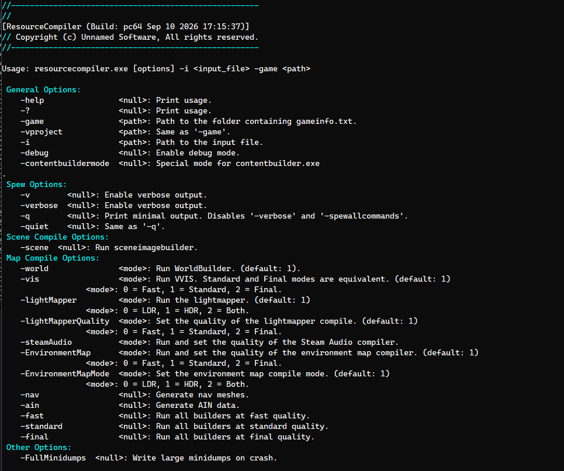

Before this existed, compiling an asset meant knowing *which* tool compiled it. A texture went through **MaterialBuilder**, a sound through **SoundBuilder**, a model through the **ModelBuilder**, a map through VBSP/VVIS/VRAD in the right order with the right flags. Six different binaries, six different sets of arguments, and an artist had to remember which one applied to whatever file they were looking at.

**ResourceCompiler** collapses all of that into one command:

```
resourcecompiler.exe -game "C:/Games/MyMod/mygame" -i "content/mymod/materials/metal/rusted_panel.vmtbuilder"
```



Point it at any asset. It figures out the rest.

---

### One entry point, dispatched by asset type

**ResourceCompiler** doesn't ask what kind of asset it's compiling — it asks **assetsystem**. `main()` calls `g_pAssetSystemMgr->QueryAssetInfo()` on the input file, reads back its `AssetType_t`, and switches on that to route the call:

```
ASSET_MATERIAL / ASSET_TEXTURE  -> CompileMaterialResource / CompileTextureResource
ASSET_MODEL                     -> CompileModelResource
ASSET_SOUND                     -> CompileSoundResource
ASSET_CLOSECAPTION              -> CompileCloseCaptionResource
ASSET_SCENE                     -> CompileSceneImageResource
ASSET_MAP                       -> CompileMapResource
```

If the asset type isn't compilable at all, it says so and exits cleanly instead of trying. There's no `-mode texture` or `-mode sound` flag to get wrong — the file itself carries that information.

---

### What it replaces for an artist

This is the actual point of the tool. Before **ResourceCompiler**, compiling a batch of changed assets meant an artist (or a script) had to:

1. Know which compiler handles `.vmtbuilder`/`.vtfbuilder` files (MaterialBuilder).
2. Know a different one handles `.wav`/`.vtfbuilder`-adjacent sound scripts (SoundBuilder).
3. Know a third for models, a fourth for close captions, a fifth for scene images.
4. For maps, run VBSP, then VVIS, then VRAD, by hand, in that exact order, then remember to also build the environment map and pack the nav mesh into the `.bsp`.

That's not one skill, it's five or six — each with its own argument order and its own failure modes. Getting the map sequence wrong (running VVIS before VBSP, for instance) doesn't fail loudly, it just produces a broken map that looks fine until someone notices the lighting is missing.

With **ResourceCompiler**, none of that is the artist's problem anymore. They give it a path. It's the same command whether the file behind that path is a texture, a sound, a model, or a map — and the same command works whether a person types it or a build script generates it. The five-or-six-tools-to-remember problem becomes a one-tool problem.

---

### The builders live in-process, not as separate executables

At startup, **ResourceCompiler** loads every builder DLL it might need as an `IAppSystemDll` module in the same process — `materialbuilder`, `soundbuilder`, `modelbuilder`, `worldbuilder`, `visbuilder`, `lightbuilder`, `environmentmapbuilder`, `closecaptionbuilder` — alongside `assetsystem`, `materialsystem`, and `filesystem_batch`. When an asset needs compiling, **ResourceCompiler** doesn't shell out to `materialbuilder.dll` as a subprocess — it builds a synthetic `argv[]` (the same arguments [MaterialBuilder](/unsuario2_website/posts/source_engine/tooling/matbld/materialbuilder) or [SoundBuilder](/unsuario2_website/posts/source_engine/tooling/sndbld/soundbuilder) would expect standalone) and calls that module's `Main()` directly, in-process:

```cpp
const int retCode = g_pMaterialBuilder->Main(argc, argv);
```

Every `Compile*Resource` call in `CGeneralCompiler` follows this same shape — build an argument list, hand it to the already-loaded builder, read back the exit code. The exception is scene images, which still shell out to `sceneimagebuilder.exe` as an external process via `StartExecutable`, and `bspzip.exe` for the final map-packing step — everything else runs in the same address space as **ResourceCompiler** itself.

---

### Maps: a full pipeline behind one set of quality flags

Maps get the most involved treatment, because a map compile isn't one step. `CCompileMap::Compile` runs, in order: world (BSP), vis, lightmap, environment map, Steam Audio, navigation, then packs the results into the final `.bsp` — copying it from a scratch directory into the correct mirrored location under the game's `maps/` folder:

```
-> WorldBuilder     (BSP geometry, portals, leafs)
-> VisBuilder        (PVS, fast / standard / final)
-> LightBuilder      (lightmap bake, LDR / HDR / both)
-> EnvironmentMapBuilder
-> SteamAudioBuilder
-> NavigationBuilder (.nav / .ain)
-> PackMap           (bspzip — folds .nav/.ain into the .bsp)
```

Each stage is independently toggled and quality-tiered from the command line — `-world 2`, `-vis 1`, `-lightMapperQuality 2`, and so on — or all set at once with `-fast`, `-standard`, or `-final`. Every stage times itself and reports pass/fail, and the whole run ends with a summary table:

```
ResourceCompiler-> Process Information:
... Building 'World'            00h:01m:12s   Yes
... Building 'Vis'               00h:00m:41s   Yes
... Building 'Lighting'          00h:04m:03s   Yes
... Building 'EnvironmentMap'    00h:00m:22s   Yes
... Building 'SteamAudio'        00h:00m:00s   Yes
... Building 'Navigation'        00h:00m:08s   Yes
... Packing 'Map'                00h:00m:02s   Yes
```

The `-game` mod directory and the map's output folder are both inferred from the input path if not passed explicitly — **ResourceCompiler** walks the file path looking for `content\`, mirrors everything after it into `game\`, and (unless `-DisableCorrectMapDir` is set) reuses that same relative folder structure under `maps\` so a source file nested in `content/mymod/maps/dev/` lands in `game/mymod/maps/dev/`, not dumped flat into `maps/`.

Worth noting: [MapBuilder](/unsuario2_website/posts/source_engine/tooling/mpbld/mapbuilder)'s own config format lists `RunResourceCompiler` as one of its available build steps, right alongside calling VBSP/VVIS/VRAD directly. **ResourceCompiler**'s in-process map pipeline is effectively the newer path — MapBuilder can either drive the classic external tools itself, or hand the whole compile off to **ResourceCompiler** in one step.

---

### ContentBuilder integration

`-contentbuildermode` is the same convention seen in the other tools in this pipeline: it flips a global (`g_ContentBuilderMode`) that changes behavior when **ResourceCompiler** is being driven by the automated build system rather than a person. Right now the only place that matters is texture/material compiles — it forwards `-keeptempfiles` down to MaterialBuilder, so when ContentBuilder starts a **N** number of simultaneous materials compiles does not delete the temporal directories causing some assets to fail the build.

---

### Why this matters for a pipeline

A pipeline where every asset type has its own compiler, its own flags, and its own invocation order is a pipeline were artists waste a lot of time doing setups. **ResourceCompiler** removes that requirement: the asset system already knows what a file is, so the compiler doesn't need to be told — it needs to be pointed at a path. Artists get one tool instead of six. Automated builds get one process to launch instead of orchestrating several. And the map pipeline specifically — the part most prone to being run out of order by hand — becomes a single command with quality presets instead of three (or six, counting environment maps, Steam Audio, and nav) manual steps.

---

### Example in action

**ResourceCompiler** compiling a material:
<video src="/unsuario2_website/media/source_engine/tooling/rescmp/rescmp_1.mp4" controls></video>

**ResourceCompiler** compiling a model:
<video src="/unsuario2_website/media/source_engine/tooling/rescmp/rescmp_2.mp4" controls></video>

**ResourceCompiler** compiling a caption:
<video src="/unsuario2_website/media/source_engine/tooling/rescmp/rescmp_3.mp4" controls></video>

---

*Part of an ongoing series on the custom Source Engine tooling I'm building for my game. More tools and systems coming.*
