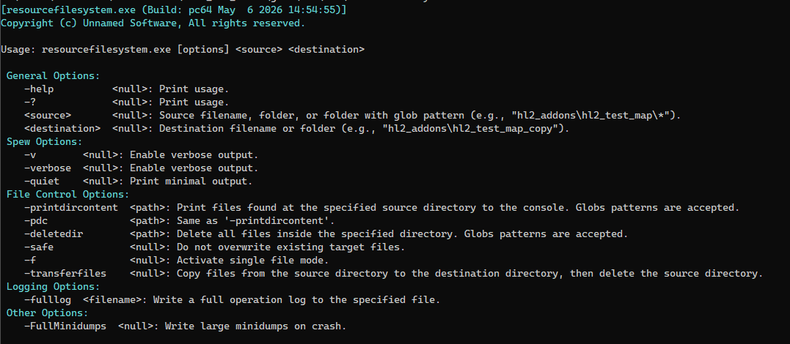

**resourcefilesystem.exe** is a command-line tool that exposes the [filesystem_batch.dll](https://www.linkedin.com/pulse/file-system-bacth-operations-source-engine-david-krekic-icmqe) API directly to the user. Copy, move, delete, and inspect files and directories using glob patterns — from the command line, with no code required.

It is invoked like any other Source tool:

```
resourcefilesystem.exe <glob_pattern> <destination> -game "C:/Games/MyMod/mygame"
```



---

### What it does

The tool wraps [IFileSystemBatch](https://www.linkedin.com/pulse/file-system-bacth-operations-source-engine-david-krekic-icmqe) into a CLI with four main operation modes:

- **Copy** — copies all files matching a glob pattern to a destination directory
- **Transfer** — copies then deletes the source (move semantics)
- **Delete** — removes a directory recursively with `-deletedir`
- **Inspect** — lists all files matching a glob pattern with `-printdircontent`

Single file mode `-f` is also supported for when you don't need glob matching.

---

### Implementation

All batch operations delegate directly to IFileSystemBatch. The tool itself is thin — it parses the command line, validates the glob pattern via `IsValidGlob()` before doing anything, and dispatches to the right operation. Error reporting is per-file: failed operations are collected into a `FileList` and printed at the end without aborting the run.

One detail worth noting: incompatible flag combinations (e.g. `-deletedir` with `-transferfiles`) are caught early with explicit sanity checks before any filesystem operation runs.

---

### Design references

- IFileSystemBatch: [filesystem_batch.dll article](https://www.linkedin.com/pulse/file-system-bacth-operations-source-engine-david-krekic-icmqe)
- Glob Pattern: [https://www.malikbrowne.com/blog/a-beginners-guide-glob-patterns/](https://www.malikbrowne.com/blog/a-beginners-guide-glob-patterns/)

---

## Example in action

- Inspect what's inside a directory: `resourcefilesystem.exe -pdc "platform/**/*.vtf"`

<video src="/unsuario2_website/media/source_engine/tooling/rsrflsys/rsrflsys_1.mp4" controls></video>

- Copy all .vtf textures from content to game directory: `resourcefilesystem.exe "platform/**/*.vtf" "D:/Downloads/test"`

<video src="/unsuario2_website/media/source_engine/tooling/rsrflsys/rsrflsys_2.mp4" controls></video>

- Move build output and delete source: `resourcefilesystem.exe -transferfiles "D:/Downloads/test/**/*" "D:/Downloads/test2"`

<video src="/unsuario2_website/media/source_engine/tooling/rsrflsys/rsrflsys_3.mp4" controls></video>

---

*Part of an ongoing series on the custom Source Engine tooling I'm building for my game. More tools and systems coming.*
