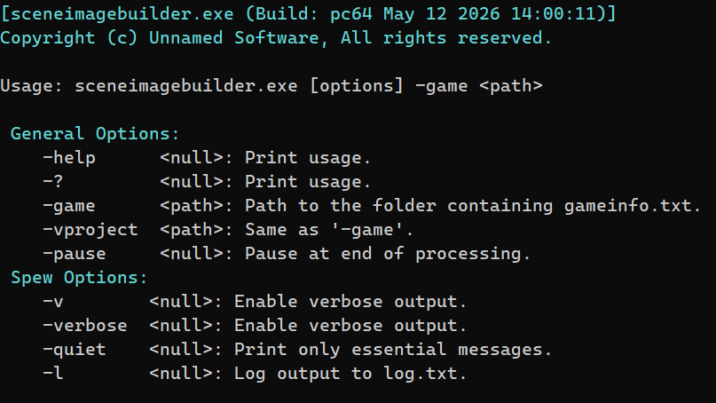

[Faceposer](https://developer.valvesoftware.com/wiki/Faceposer) is Source Engine's GUI tool for creating and compiling [choreography scenes](https://developer.valvesoftware.com/wiki/Choreography_creation) (.vcd files). It works. But opening a GUI just to compile scenes as part of an automated build pipeline makes no sense.

[SceneImageBuilder](https://github.com/Unusuario2/SceneImageBuilder) does the same compilation step from the command line.

It is invoked like any other Source tool:

```
sceneimagebuilder.exe -game "C:/Games/MyMod/mygame"
```



The code can be [found here](https://github.com/Unusuario2/SceneImageBuilder). Although it is a bit outdated, the core system remains the same.

---

### What it does

Source Engine doesn't load `.vcd` files directly at runtime. It loads a compiled scenes.image binary that packs all scenes together. [Faceposer](https://developer.valvesoftware.com/wiki/Faceposer) handles that compilation step through its GUI. [SceneImageBuilder](https://github.com/Unusuario2/SceneImageBuilder) replaces that step with a single command, no GUI required.

---

### Why this matters for a pipeline

Every tool in my pipeline follows the same pattern: one command, `-game` path, done. [SceneImageBuilder](https://github.com/Unusuario2/SceneImageBuilder) fits that contract. You can call it from a build script or `contentbuilder.exe` the same way you call VBSP, VVIS, or VRAD — no GUI, no manual steps, no interruptions.

---

### Design references

- [CTier3SteamApp: Source SDK AppFramework](https://github.com/ValveSoftware/source-sdk-2013/blob/master/src/public/tier3/tier3.h)

---

## Example in action

- sceneimagebuilder.exe compiling all the .vcd files into scenes.image

<video src="/unsuario2_website/media/source_engine/tooling/scnimgbld/scnimgbld_1.mp4" controls></video>

---

*Part of an ongoing series on the custom Source Engine tooling I'm building for my game. More tools and systems coming.*
