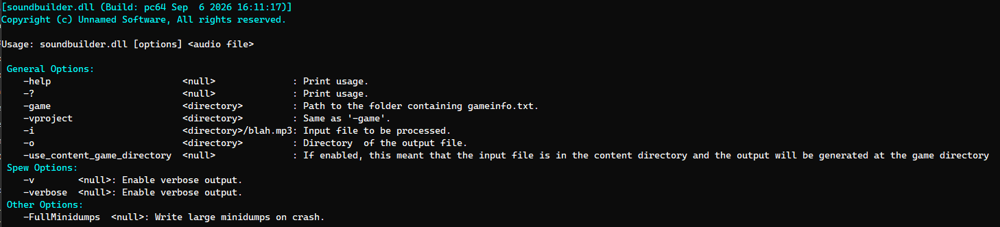

[AudioProcess](/blog/audioprocess-mass-audio-converter-for-the-source-engine) batch-converts a whole directory of audio at once — you point it at a folder and it walks every file. That's the right tool when you're bulk-migrating a library. It's the wrong shape for the resource compiler, which doesn't think in directories — it thinks in individual assets that need to be compiled, one at a time, on demand, using the **assetsystem** system.

SoundBuilder is that per-asset version: an `IAppSystemDll` module — `soundbuilder.dll` — that the resource compiler loads and calls to turn one audio source file into one game-ready `.wav`.

```
resourcecompiler.exe -game "Y:\buildworker\tssr_rel_win64\game\platform" -i "Y:\buildworker\tssr_rel_win64\content\platform\sound\core_diagnosis\core_diagnosis_125khz_to_10khz.wav"

or 

resourcecompiler.exe -i "Y:\buildworker\tssr_rel_win64\content\platform\sound\core_diagnosis\core_diagnosis_125khz_to_10khz.wav"

```



---

### What it does

SoundBuilder takes a single input file, validates it, converts it, and writes it out — nothing more. It doesn't scan directories, and it doesn't accept a list of files. That's intentional: as a module, it's meant to be called once per asset by whatever is driving the build.

Before doing any conversion, it asks the asset system what kind of file it's looking at:

```cpp
const IAssetInfo* pAssetInfo = g_pAssetSystemMgr->QueryAssetInfo(this->m_szFullPathInputFile);
if (pAssetInfo->GetAssetType()->GetAssetType() != AssetType_t::ASSET_SOUND)
{
    Warning("File is not an audio file: %s\n", this->m_szFullPathInputFile);
    return -1;
}
```

If the asset system doesn't recognize the file as a sound asset, SoundBuilder refuses to run.

---

### Two ways to resolve the output path

- **`-o <dir>`** — manual mode. Used by [AudioProcess](/blog/audioprocess-mass-audio-converter-for-the-source-engine)
- **`-use_content_game_directory`** — mirror mode. The input file is expected to live under the project's content search path; SoundBuilder strips that prefix and rebuilds the same relative path under the game directory. No `-o` needed — the output location is derived entirely from where the source file lives. Used by the **resourcecompiler system**

Mirror mode is the one that matters for the pipeline: it's what lets the resource compiler call SoundBuilder on any changed source file in `content/` and land the compiled `.wav` in the matching spot under the game directory, without anything having to compute or pass that path in.

---

### Why a module instead of a standalone tool

Every other stage in the pipeline that compiles a specific asset type — textures, models, scenes — is exposed as its own builder that the resource compiler can call by asset type. SoundBuilder fits that same shape for audio, so the compiler can find it, hand it one file, and get one compiled result back.

---

## Example in action

- soundbuilder.dll being invoked by the resource compiler to compile a single changed sound asset

<video src="/unsuario2_website/media/source_engine/tooling/sndbld/sndbld_1.mp4" controls></video>

---

### Design references

- [AudioProcess: Mass audio converter for the Source Engine](/blog/audioprocess-mass-audio-converter-for-the-source-engine)
- [FFmpeg](https://www.ffmpeg.org/)

---

*Part of an ongoing series on the custom Source Engine tooling I'm building for my game. More tools and systems coming.*
