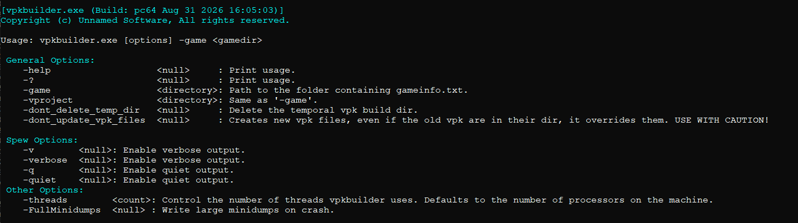

Packing a mod or a build into `.vpk` files means deciding which directories go in, which files get excluded, whether the pack needs to be split into chunks, whether it needs to be signed, and then actually running `vpk.exe` with the right flags. Doing that by hand or with a custom script, doesn't scale — and it's easy to forget a flag, not using the lastest script or leave a stale file in the pack.

VpkBuilder wraps that entire process into a single command and a config file.

```
vpkbuilder.exe -game "C:/Games/MyMod/mygame"
```



---

### What it does

VpkBuilder reads a KeyValues script (`scripts/tools/vpkbuilder_settings.txt`) that defines one or more VPKs to build. For each one it collects the right files, stages them in a temp directory, calls `vpk.exe` to pack them, and moves the result to the output directory — cleaning up after itself when it's done.

It's the same philosophy as [MapBuilder](/blog/mapbuilder-standardizing-automating-map-compilation-across-the-pipeline): the process is defined once, in a config file, and every person or automated system that runs `vpkbuilder.exe -game <dir>` gets the exact same result.

Example of `scripts/tools/vpkbuilder_settings.txt` file:
```
"VpkBuilder"
{
    "VpkTempDir"            "_buildvpk"     // Relative to the game dir. Full paths are also supported
    "VpkPrivateSignKey"     "../../../../src/devtools/sign/vpksignature.privatekey.vdf"    // This is always relative to the path of this file.  
    "VpkPublicSignKey"      "../../../../src/devtools/sign/vpksignature.publickey.vdf"  

    // Structure: Every new key is a vpk to be created
    // "<vpkname>"
    // {
    //      "GenerateVpkMultiChunk"             "<boolean>"             // If set to 1 it will generate multichunk vpk files
    //      "VpkMultiChunkSize"                 "<unsigned integer>"    // Size of the vpk chunk in MB
    //      "VpkAlignBuild"                     "<unsigned integer>"    // Padding of the files inside the vpk, if set to anything greated than 0 needs to have enabled the VpkUseFriendlySteamPipeAlgorithm 
    //      "VpkUseFriendlySteamPipeAlgorithm"  "<boolean>"             // Enable friendly steam pipe shit
    //      "VpkOutDir"                         "<directory>"           // Where we put the vpk after the build (always relative to the game dir)  
    //
    //     // This is a whitelist, if you want your to add some files, dir and more shit to the vpk put it in this KeyValue
    //     // Everything is relative to the gamedir
    //     "VpkFiles"
    //     {
    //         "DirAddAll"         "materials"         // Adds all the files inside the dir into the vpk. These files will be present in the vpk no matter whats in the VpkExcludeFiles KeyValue 
    //         "DirConditional"    "vgui"              // Adds the file in this dir, but these files can later be removed by the presets in the VpkExcludeFiles KeyValue 
    //         "Glob"              "vgui/**/*.vmt"     // Glob Pattern, add only the desired filed, the VpkExcludeFiles KeyValue can remove these some of these files.
    //         "File"              "test.vmt"          // For adding single files, the VpkExcludeFiles KeyValue cannot exclude this file.
    //     }
    //
    //     // This is a 
    //     "VpkExcludeFiles"           
    //     {
    //         "Dir"       "materials"      // Exclude this directory from the vpk.
    //         "Glob"      "vgui/**/*.vmt"  // Glob Pattern, exclude the files matching this pattern.
    //         "File"      "test.vmt"       // For removing single files.
    //     }
    // }

    "platform"
    {
        "GenerateVpkMultiChunk"             "1"
        "VpkMultiChunkSize"                 "100"
        "VpkUseFriendlySteamPipeAlgorithm"  "1"
        "VpkOutDir"                         ""  
        "VpkAlignBuild"                     "1"

        "VpkFiles"
        {
            "DirAddAll"         "cfg"         
            "DirAddAll"         "maps"         
            "DirAddAll"         "materials"         
            "DirAddAll"         "media"         
            "DirAddAll"         "models"         
            "DirAddAll"         "particles"         
            "DirAddAll"         "resource"         
            "DirAddAll"         "sound"         
            "DirAddAll"         "sound"         
            "DirAddAll"         "soundscapes"         
            "DirAddAll"         "soundscript"         
            "DirAddAll"         "surfaceproperties"         
        }

        "VpkExcludeFiles"           
        {
            // Safe guard, just in case someone add these files by error
            "Dir"       "bin"         
            "Dir"       "tools"         
            "Dir"       "shaders"         
            "Glob"      "/**/*.bat"    
            "File"      "gameinfo.txt"
            "File"      "thirdpartylegalnotices.txt"
        }
    }

    "shaders"
    {
        "GenerateVpkMultiChunk"             "1"
        "VpkMultiChunkSize"                 "50"
        VpkUseFriendlySteamPipeAlgorithm    "1"
        "VpkOutDir"                         "" 
        "VpkAlignBuild"                     "1"

        "VpkFiles"
        {
            "DirAddAll"         "shaders"         
        }

        "VpkExcludeFiles"           
        {
        }
    }
}
```

---

### Defining a VPK

Each top-level key in the settings file is the name of a VPK to build. Inside it, a `VpkFiles` block controls what goes in:

| Key | Behavior |
|---|---|
| `DirAddAll` | adds every file in a directory (recursively), unconditionally |
| `DirConditional` | adds every file in a directory, but the files can still be excluded later |
| `Glob` | adds files matching a glob pattern |
| `File` | adds a single file |

The distinction between `DirAddAll` and `DirConditional` matters: files added with `DirAddAll` go into a separate static list that the exclude step never touches. Everything else can still be filtered out afterward.

A `VpkExcludeFiles` block runs after that, supporting `Dir`, `Glob`, and `File` keys the same way, to remove anything that shouldn't ship.

---

### Update mode vs full rebuild

By default, VpkBuilder looks for existing `.vpk` files matching the target name in the output directory. If it finds them, it copies them into the temp build directory first, so `vpk.exe` updates the existing pack instead of building from scratch. `-dont_update_vpk_files` skips that and forces a clean rebuild — the settings file has a warning attached to it for a reason, since it overwrites whatever was there.

---

### Signing

If `VpkPrivateSignKey` and `VpkPublicSignKey` are set in the settings file, VpkBuilder resolves both key paths relative to the settings file's own directory, verifies they exist, and passes them to `vpk.exe` with `-K`/`-k` for every VPK it builds. If either key is missing, the tool prints a warning and builds unsigned packs instead of failing outright.

---

### Implementation

The build for each VPK follows the same sequence:

```
-> Resolve existing VPKs (update mode) or start clean
-> Copy all included files into a per-VPK temp directory
-> Build the vpk.exe command line (align, chunking, signing flags)
-> StartExecutable() and wait for it to finish
-> Move the resulting .vpk(s) to the output directory
-> Delete the temp directory (unless -dont_delete_temp_dir)
```

---

### Why this matters for a pipeline

Every VPK in a shipped build needs the same care: the right files, nothing stale, correctly chunked and signed if that's required. Without a standardized tool, that's a manual `vpk.exe` script invocation someone has to remember, per pack, per build. VpkBuilder makes it declarative — the config says what a VPK contains, and `-game <dir>` is the only thing that changes between a developer's machine.

---

## Example in action

- vpkbuilder.exe building and signing a multi-chunk VPK from the settings file

<video src="/unsuario2_website/media/source_engine/tooling/vpkbld/vpkbld_1.mp4" controls></video>


---

*Part of an ongoing series on the custom Source Engine tooling I'm building for my game. More tools and systems coming.*
